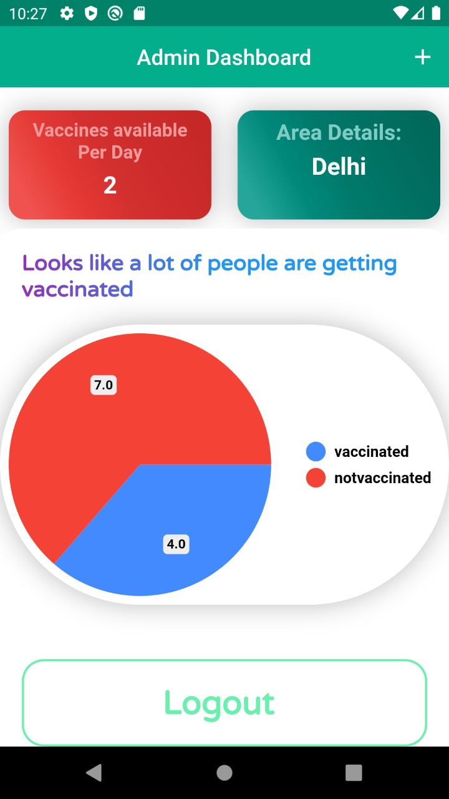

<p align="center">
  <a href="https://github.com/Coder-Bhai/covid19-VijayApp">
    
  </a>
</p>
<p align="center">
  It is an organized system for the government administration and the local people (as users) for the COVID-19 vaccination residing in any prescribed area. For the administration, the algorithm prioritizes the people, which are to be vaccinated, on the basis of the priority list declared by the Government of India. Also, for the administration, the administration will have data of local people under that administration area whose some of the entries are aadhar number, isVaccinated, age, occupation etc. It allows user, after entering the aadhar number on the platform, the date of vaccination allotted for him/her.
</p>
<hr style="width:50%;text-align:left;margin-left:0">
<p align="center">
Show some love 💜 and Star ⭐️ the Repository to support the project.
</p>

|                 Onboarding Screen                 |                 Admin Login                       |                    Admin Dashboard                |
|:-------------------------------------------------:|:-------------------------------------------------:|:-------------------------------------------------:|
|  |  |  |

## What’s In This Document

- [Get Up and Running in 5 Minutes](#rocket-get-up-and-running-in-5-minutes)
- [Flutter / Dart Packages Used](#ballot_box-flutter--dart-packages-used)
- [Thanks to Contributors and Sponsors](#purple_heart-thanks)

## :rocket: Get Up and Running in 5 Minutes

You can get the Covid19-Vijay App up and running on your local dev environment in 5 minutes with these four steps:

1. **Install the Flutter SDK & Android Studio. [Instructions](https://medium.com/enappd/install-flutter-on-windows-and-mac-1fd1dde453ba).**

2. **Open Terminal & navigate to the root directory of the project.**

    ```shell
    cd covid19-VijayApp
    ```

3. **Run and launch the build on preferred device.**

   ```shell
   flutter run
   ```

4. **Open the source code and start editing!**

   Your app is now running on your physical device or emulator. Open the `lib` directory in Android Studio itself and edit `*.dart` files. Hot Reload your changes, and the app will update in real time!

At this point, you’ve got the fully functional Covid19-Vijay App running. For additional information on how you can customize your Flutter Apps, see [Google Codelabs](https://codelabs.developers.google.com/codelabs/flutter/) and [HackerNoon Guide](https://hackernoon.com/making-the-most-of-flutter-from-basics-to-customization-433171581d01).

## :ballot_box: Flutter / Dart Packages Used
|    Package Name    	| Package Version 	|                           Package URL                          	|
|:------------------:	|:---------------:	|:--------------------------------------------------------------:	|
| simple_animations       	|      latest     	| [Open on pub.dev](https://pub.dev/packages/simple_animations)    	    |
| font_awesome_flutter	|      latest     	| [Open on pub.dev](https://pub.dev/packages/font_awesome_flutter)  |
| firebase_core 	    |      latest     	| [Open on pub.dev](https://pub.dev/packages/firebase_core)          |
| firebase_auth	        |      latest     	| [Open on pub.dev](https://pub.dev/packages/firebase_auth)            |
| cloud_firestore     	|      latest     	| [Open on pub.dev](https://pub.dev/packages/cloud_firestore)         |
| google_fonts 	|      latest     	| [Open on pub.dev](https://pub.dev/packages/google_fonts) 	|
| pie_chart          	|      latest     	| [Open on pub.dev](https://pub.dev/packages/pie_chart)             |


## :purple_heart: Thanks

Thanks to all contributors and to sponsors for supporting the project.
